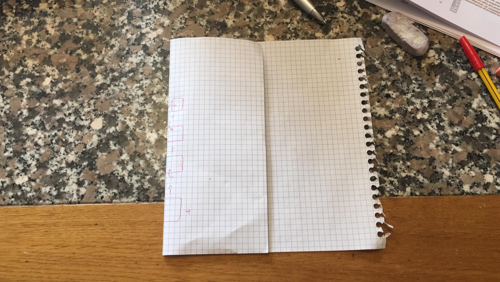
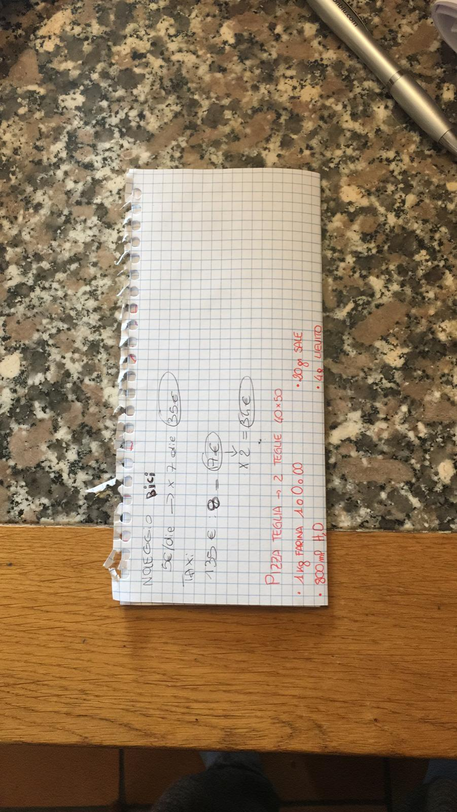
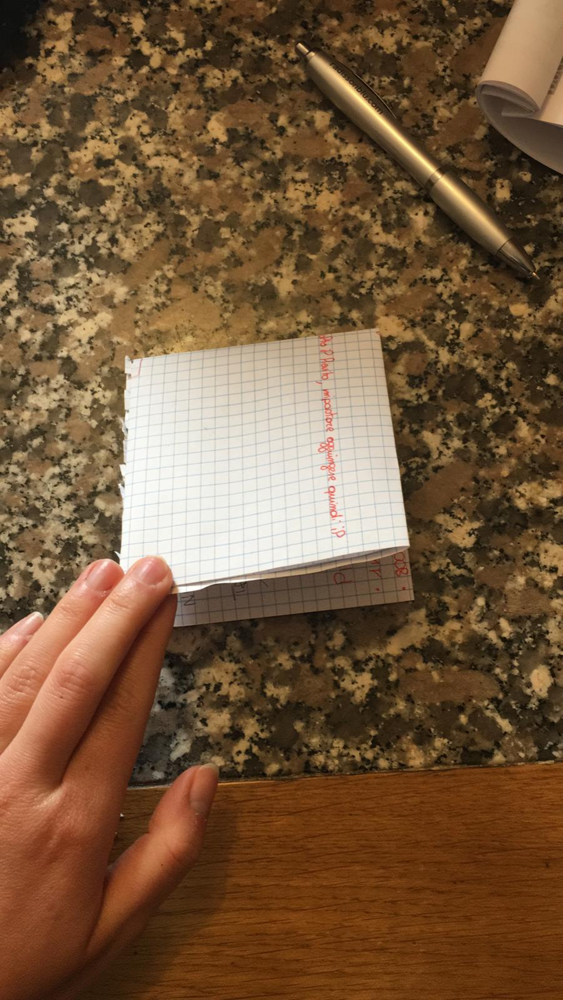

# Pizza

10 hours rising

## Ingredients

Per una teglia 40x45:
* 500 gr farina
* 400gr di acqua
* 2 gr lievito di birra
* 10 gr sale
* 20 gr olio

## Instructions

* Sciogliere il lievito nell'acqua.
* Impastare la farina con meta' dell'acqua.
* Una volta impastato aggiungere l'altra meta' dell'acqua e continuare a impastare.
* Aggiungere sale e olio e continuare a impastare.
* Impastare finché l'impasto e' liscio e omogeneo.
* Lasciar riposare per 15 minuti.
* Schiacciare l'impasto con le dita per dargli una forma rettangolare.
* Piegare l'impasto in questo modo e assicurarsi che non ci siano delle aperture per catturare piu' aria possibile:

* Lasciar riposare per 15 minuti e poi ripetere il passo precedente per tre volte (sempre lasciando riposare per 15 minuti).
Coprire sempre l'imasto con farina/olio e pellicola per non far seccare la superficie.
* Lasciar lievitare per 10 ore.
* Due ore prima di infornare la pizza, stenderla con le dita nella teglia. Coprirla con un uno straccio umido
e lasciarla riposare nel forno spento.
* Quando mancano 10 minuti, togliere l'impasto dal forno e accenderlo al massimo e poi infornare la pizza condita.
* Cuocere per 15/20 minuti.

## Credits

* Mia cugina
